# Aztec Aave Wrapper Protocol

**Version:** 1.0.0-mvp
**Last Updated:** January 2026
**Status:** Development (Devnet)

---

## Abstract

Aztec Aave Wrapper is a privacy-preserving protocol that enables users to earn yield on Aave V3 (Ethereum L1) while keeping their identity completely private. Users interact exclusively through Aztec L2, where their addresses are never revealed on L1. The protocol uses cross-chain messaging with cryptographic commitments to decouple user identity from DeFi positions.

---

## 1. Introduction

### Problem Statement

DeFi lending protocols like Aave provide attractive yield opportunities, but all interactions are publicly visible on-chain. This creates several issues:

- **Identity Exposure**: Wallet addresses are linked to financial positions
- **Front-running Risk**: Visible transactions enable MEV extraction
- **Privacy Leakage**: Position sizes and timing reveal user behavior patterns

### Solution

Aztec Aave Wrapper introduces a privacy layer between users and Aave:

1. Users hold private token balances on Aztec L2
2. Deposit/withdraw requests are initiated from L2 with hashed identities
3. L1 execution is permissionless - anyone can relay transactions
4. Position receipts are encrypted notes visible only to the owner

---

## 2. Protocol Overview

```mermaid
flowchart LR
    subgraph "User Journey"
        A["1. BRIDGE<br/>(One-time)"] --> B["2. DEPOSIT<br/>(Private)"]
        B --> C["3. WITHDRAW<br/>(Private)"]
    end

    A -- "L1 → L2 USDC<br/>User visible" --> A
    B -- "L2 → Aave V3<br/>User hidden" --> B
    C -- "Aave V3 → L2<br/>User hidden" --> C
```



### Key Properties

| Property | Guarantee |
|----------|-----------|
| **Identity Privacy** | L1 never sees user's L2 address; it sees `ownerHash = poseidon2(owner)` |
| **Position Privacy** | Encrypted notes - only owner can view balances |
| **Execution Privacy** | Anyone can execute L1 txs - no wallet linkage |
| **Censorship Resistance** | Permissionless relay model |

---

## 3. Architecture

### Contract Topology

```mermaid
flowchart TB
    subgraph L2["AZTEC L2"]
        AW["AaveWrapper (Noir)<br/>─────────────────<br/>• request_deposit()<br/>• finalize_deposit()<br/>• request_withdraw()<br/>• finalize_withdraw()<br/>• cancel_deposit()<br/>• claim_refund()"]
        BT["BridgedToken (Noir)<br/>─────────────────<br/>• mint / burn / transfer"]
    end

    subgraph L1["ETHEREUM L1"]
        AP["AztecAavePortalL1<br/>─────────────────<br/>• executeDeposit()<br/>• executeWithdraw()"]
        TP["TokenPortal<br/>─────────────────<br/>• L1↔L2 bridge"]
        AAVE["Aave V3 Pool<br/>─────────────────<br/>• supply / withdraw"]
    end

    AW <--> |"Aztec<br/>Message<br/>Bridge"| AP
    BT <--> TP
    AP <--> TP
    AP <--> AAVE
```



### Layer Responsibilities

| Layer | Responsibilities |
|-------|------------------|
| **L2 AaveWrapper** | Intent creation, note management, privacy logic, refund handling |
| **L2 BridgedToken** | Token representation, authorized mint/burn for bridge operations |
| **L1 Portal** | Message consumption, Aave interaction, share tracking |
| **L1 TokenPortal** | Token custody, bridge authorization |

---

## 4. Privacy Model

### How Privacy Works

The protocol achieves privacy through **identity decoupling**: the L2 user address is never transmitted to L1. Instead, a one-way cryptographic commitment is used.


> **Security**: Given `ownerHash`, an attacker cannot recover the original address. `poseidon2` is a ZK-friendly hash function.

### What is Hidden vs Revealed

#### On L1 (Ethereum) - PUBLIC

| Data Point | Visible? | What is Revealed |
|------------|----------|------------------|
| User L2 address | **NO** | Only `ownerHash = poseidon2(owner)` appears (linkable across intents) |
| User L1 wallet | **NO** | Relayer executes, not user |
| `intentId` | Yes | Opaque identifier, but linkable to `ownerHash` and lifecycle events |
| `amount` | Yes | Deposit/withdraw amount |
| `deadline` | Yes | Expiration timestamp |
| `asset` | Yes | Token address (MVP deployment uses USDC) |
| `shares` | Yes | aToken shares from Aave |

#### On L2 (Aztec) - PRIVATE NOTES + PUBLIC METADATA

| Data Point | Visible? | Who Can Access |
|------------|----------|----------------|
| User L2 address | Private | Only user's own wallet (note ownership) |
| Intent owner mapping | **Public** | `intentId → owner` for pending intents |
| Intent status | **Public** | Lifecycle status is publicly readable |
| PositionReceiptNote | Encrypted | Only note owner can decrypt |
| Position balance | Private | Only owner |
| Transaction history | Private | Notes are private, but public intent events exist |
| Claiming secret | Private | Only user who generated it |

### Privacy by Protocol Phase

```mermaid
flowchart TB
    subgraph P1["PHASE 1: BRIDGE (L1→L2)"]
        direction LR
        P1L["🔓 LOW PRIVACY"]
        P1D["REVEALED: User's L1 wallet<br/>HIDDEN: Nothing"]
    end

    subgraph P2["PHASE 2: DEPOSIT (L2→L1→L2)"]
        direction LR
        P2L["🔒 HIGH PRIVACY"]
        P2D["REVEALED: ownerHash, amount<br/>HIDDEN: User L2 address, L1 wallet (ownerHash is linkable)"]
    end

    subgraph P3["PHASE 3: HOLDING POSITION"]
        direction LR
        P3L["🔐 MAXIMUM PRIVACY"]
        P3D["REVEALED: Nothing<br/>HIDDEN: Owner, balance, existence"]
    end

    subgraph P4["PHASE 4: WITHDRAW (L2→L1→L2)"]
        direction LR
        P4L["🔒 HIGH PRIVACY"]
        P4D["REVEALED: ownerHash, amount<br/>HIDDEN: User identity (ownerHash links deposits)"]
    end

    subgraph P5["PHASE 5: UNBRIDGE (L2→L1)"]
        direction LR
        P5L["🔓 LOW PRIVACY"]
        P5D["REVEALED: Destination wallet<br/>HIDDEN: Use different wallet"]
    end

    P1 --> P2 --> P3 --> P4 --> P5

    style P1L fill:#C62828,color:#fff
    style P2L fill:#2E7D32,color:#fff
    style P3L fill:#1B5E20,color:#fff
    style P4L fill:#2E7D32,color:#fff
    style P5L fill:#C62828,color:#fff
```



### Cross-Chain Message Privacy

| Message | Direction | Content | Privacy Impact |
|---------|-----------|---------|----------------|
| Deposit intent | L2 → L1 | `ownerHash`, amount, deadline | Address hidden via hash; intents linkable by ownerHash |
| Deposit confirm | L1 → L2 | `intentId`, shares | No user data |
| Withdraw intent | L2 → L1 | `ownerHash`, amount, deadline | Address hidden via hash; intents linkable by ownerHash |
| Withdraw confirm | L1 → L2 | `intentId`, amount | No user data; currently not secret-bound |

### Threat Model

| Threat | Protected? | Mechanism |
|--------|------------|-----------|
| L1 observer identifying depositor | **Yes** | `ownerHash` is one-way; cannot reverse |
| L1 observer linking multiple deposits | **Yes** | Stable `ownerHash` links intents |
| L1 observer linking deposit to withdrawal | **Yes** | `ownerHash` and `intentId` are visible |
| Relayer learning user identity | **Yes** | No authentication needed to execute |
| L2 observer seeing position sizes | **Yes** | Encrypted PositionReceiptNote |
| Correlating bridge with deposit | **Partial** | Timing/amounts may correlate |

### Privacy Limitations

1. **Bridge transactions visible**: Initial L1→L2 bridge reveals source wallet
   - *Mitigation*: Use fresh wallet, bridge in advance, use common amounts

2. **Amount fingerprinting**: Unique amounts (e.g., 1,234.56 USDC) are trackable
   - *Mitigation*: Use round numbers, split into common sizes

3. **Timing correlation**: Immediate bridge→deposit links operations
   - *Mitigation*: Wait between operations, batch with other users

4. **Anonymity set size**: Privacy strength depends on number of users
   - *Mitigation*: Protocol adoption increases privacy for all users

---

## 5. Core Mechanisms

### 5.1 Deposit Flow


**State Transitions:**

| Step | L2 State | L1 State |
|------|----------|----------|
| After request | `intent_status = PENDING_DEPOSIT` | - |
| After execute | - | `consumedDepositIntents[id] = true`, `intentShares[id] = shares` |
| After finalize | `intent_status = CONFIRMED`, PositionReceiptNote created | - |

### 5.2 Withdrawal Flow


### 5.3 Refund Mechanisms

```mermaid
flowchart TB
    subgraph Deposit["Expired Deposit (cancel_deposit)"]
        D1["Deadline passes"] --> D2["User calls cancel_deposit()"]
        D2 --> D3["L2 mints net_amount back"]
        D3 --> D4["Intent → CANCELLED"]
        D5["⚠️ Fee NOT refunded"]
    end

    subgraph Withdraw["Expired Withdrawal (claim_refund)"]
        W1["Deadline passes"] --> W2["User calls claim_refund()"]
        W2 --> W3["PENDING note nullified"]
        W3 --> W4["New ACTIVE note created"]
        W4 --> W5["Position restored"]
    end
```



---

## 6. Fee Structure

| Parameter | Value | Description |
|-----------|-------|-------------|
| `FEE_BASIS_POINTS` | 10 | 0.1% protocol fee |
| `BASIS_POINTS_DENOMINATOR` | 10,000 | 100% = 10,000 |
| `MIN_DEPOSIT_AMOUNT` | 1,000,000 | 1 USDC (6 decimals) |

```mermaid
flowchart LR
    A["User deposits<br/>100 USDC"] --> B{"Fee Split"}
    B --> |"0.1%"| C["0.1 USDC<br/>→ Treasury"]
    B --> |"99.9%"| D["99.9 USDC<br/>→ Burned → Aave"]
```



**On Cancellation:** Only `net_amount` is refunded. The 0.1% fee is retained by the protocol.

---

## 7. Security Model

### Trust Assumptions

| Component | Trust Assumption |
|-----------|------------------|
| **Aztec L2** | Validity proofs ensure correct execution |
| **Aztec Bridge** | Messages are delivered if included in proven blocks |
| **L1 Portal** | Smart contract logic is correct (auditable) |
| **Aave V3** | Battle-tested, audited lending protocol |
| **TokenPortal** | Correctly tracks L1↔L2 token parity |

### Attack Vectors & Mitigations

| Attack | Mitigation |
|--------|------------|
| **Replay attacks** | `consumedDepositIntents` / `consumedWithdrawIntents` mappings |
| **Intent spoofing** | L2→L1 messages cryptographically verified via Aztec outbox |
| **Deadline manipulation** | L1 enforces bounds: 5 min ≤ deadline ≤ 24 hours |
| **Unauthorized cancellation** | `intent_owners` mapping verifies caller |
| **Double-spend on L2** | Tokens burned atomically in request_deposit |

### Pausability

The L1 portal inherits OpenZeppelin's `Pausable`. In emergency:
- Owner can pause all L1 operations
- Existing positions remain safe in Aave
- L2 operations continue but L1 execution blocked

---

## 8. Protocol Parameters

### L2 Parameters (AaveWrapper)

| Parameter | Value | Modifiable |
|-----------|-------|------------|
| Fee basis points | 10 (0.1%) | No (compile-time) |
| Min deposit | 1 USDC | No (compile-time) |
| Fee treasury | Set at init | No |

### L1 Parameters (AztecAavePortalL1)

| Parameter | Value | Modifiable |
|-----------|-------|------------|
| `MIN_DEADLINE` | 5 minutes | No (constant) |
| `MAX_DEADLINE` | 24 hours | No (constant) |
| `aztecOutbox` | Set at deploy | No (immutable) |
| `aztecInbox` | Set at deploy | No (immutable) |
| `aavePool` | Set at deploy | No (immutable) |
| `tokenPortal` | Set at deploy | No (immutable) |

---

## 9. Limitations & Future Work

### Current Limitations (Implementation)

| Limitation | Impact |
|------------|--------|
| **Withdraw confirmation not secret-bound** | The L1→L2 withdraw confirmation currently uses an empty `secretHash`, so finalization is not authenticated by the user’s secret; privacy relies only on note ownership. |
| **Owner hash is stable** | `ownerHash = poseidon2(owner)` is deterministic, so L1 observers can cluster all intents by ownerHash. |
| **Public intent metadata** | L2 stores `intent_owners` and `intent_status` publicly for routing and lifecycle tracking. |

### MVP Constraints

| Constraint | Rationale |
|------------|-----------|
| **USDC only** | Simplifies initial implementation |
| **Full withdrawal only** | Avoids partial note accounting complexity |
| **L1 Aave only** | Direct integration, no cross-chain Aave |
| **No relayer incentives** | Anyone can execute; no explicit rewards |

### Potential Enhancements (Privacy-Focused)

1. **Amount obfuscation** - Allow optional rounding/padding (or split flows) to reduce amount fingerprinting.
2. **Execution delay/batching** - Introduce delayed relaying or batching to reduce timing correlation.

### Potential Enhancements (General)

1. **Multi-asset support** - Extend to ETH, WBTC, other Aave-supported assets
2. **Partial withdrawals** - Allow withdrawing portion of position
3. **Relayer rewards** - Explicit incentive mechanism for execution
4. **L2 Aave integration** - When Aave deploys on Aztec-compatible L2s
5. **Yield aggregation** - Optimize across multiple lending protocols

---

## Appendix A: Message Formats

### L2→L1 Deposit Message

```rust
sha256_to_field([
    intent_id         : Field,    // Unique intent identifier
    owner_hash        : Field,    // poseidon2(L2_owner_address)
    asset             : Field,    // L1 token address as Field
    amount            : u128,     // Net amount after fee
    original_decimals : u8,       // Token decimals (6 for USDC)
    deadline          : u64,      // Unix timestamp
    salt              : Field,    // poseidon2(caller, secret_hash)
    secret_hash       : Field     // For L1→L2 message authentication
])
```

### L1→L2 Deposit Confirmation

```solidity
sha256ToField(abi.encodePacked(
    intentId,   // bytes32
    asset,      // address → bytes32
    shares      // uint128 → bytes32
))
// Note: secretHash passed separately to sendL2Message
```

### L2→L1 Withdraw Message

```rust
sha256_to_field([
    intent_id   : Field,
    owner_hash  : Field,
    amount      : u128,
    deadline    : u64,
    asset_id    : Field,
    secret_hash : Field
])
```

---

## Appendix B: Contract Interfaces

### AaveWrapper (L2)

```rust
// Deposit operations
fn request_deposit(asset: Field, amount: u128, original_decimals: u8,
                   deadline: u64, secret_hash: Field) -> Field
fn finalize_deposit(intent_id: Field, asset_id: Field, shares: u128,
                    secret: Field, message_leaf_index: Field)
fn cancel_deposit(intent_id: Field, current_time: u64, net_amount: u128)

// Withdrawal operations
fn request_withdraw(nonce: Field, amount: u128, deadline: u64,
                    secret_hash: Field) -> Field
fn finalize_withdraw(intent_id: Field, asset_id: Field, amount: u128,
                     secret: Field, message_leaf_index: Field)
fn claim_refund(nonce: Field, current_time: u64)
```

### AztecAavePortalL1 (L1)

```solidity
function executeDeposit(
    DepositIntent calldata intent,
    uint256 l2BlockNumber,
    uint256 leafIndex,
    bytes32[] calldata siblingPath
) external whenNotPaused

function executeWithdraw(
    WithdrawIntent calldata intent,
    bytes32 secretHash,
    uint256 l2BlockNumber,
    uint256 leafIndex,
    bytes32[] calldata siblingPath
) external whenNotPaused
```

---

## References

- [Aztec Protocol Documentation](https://docs.aztec.network/)
- [Aave V3 Technical Paper](https://github.com/aave/aave-v3-core/blob/master/techpaper/Aave_V3_Technical_Paper.pdf)
- [Detailed Deposit Flow](./docs/DEPOSIT_TRANSACTION_FLOW.md)
- [Detailed Withdrawal Flow](./docs/WITHDRAW_TRANSACTION_FLOW.md)
